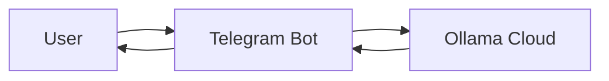

# Diagrams Skill

Generate diagrams using ASCII art or Python plotting libraries. No external services required.

## ASCII Diagrams (No Dependencies)

For flowcharts, architecture diagrams, and simple graphs, use ASCII art directly:

```python
diagram = """
+--------+     +--------+     +--------+
|  User  | --> |  Bot   | --> |  Ollama |
+--------+     +--------+     +--------+
"""
print(diagram)
```

## Mermaid-style Text Diagrams

You can generate Mermaid-flavored text that renders in many Markdown viewers:

```python
mermaid = """

"""
print(mermaid)
```

## Graphviz Diagrams (Optional)

If `graphviz` Python package is available, generate PNG/SVG:

```python
# REQUIRE: graphviz
from graphviz import Digraph

dot = Digraph(comment="Architecture")
dot.node("A", "User")
dot.node("B", "Bot")
dot.node("C", "Ollama")
dot.edge("A", "B")
dot.edge("B", "C")
dot.render("architecture", format="png", cleanup=True)
print("Created architecture.png")
```

## Matplotlib Diagrams (Optional)

If `matplotlib` is available, create charts and graphs:

```python
# REQUIRE: matplotlib
import matplotlib.pyplot as plt

fig, ax = plt.subplots()
ax.plot([1, 2, 3], [4, 5, 6])
ax.set_title("Example Chart")
fig.savefig("chart.png")
print("Created chart.png")
```

## Recommendations

- Prefer ASCII for flowcharts, architecture, and simple structures.
- Use Mermaid text when the user might view it in a Markdown/Mermaid-aware client.
- Use Graphviz or matplotlib only when the user explicitly asks for an image file.
- Always save generated images to the workspace and use `[SEND_FILE:chart.png]` to deliver them.
- Keep diagrams simple and readable in Telegram.
